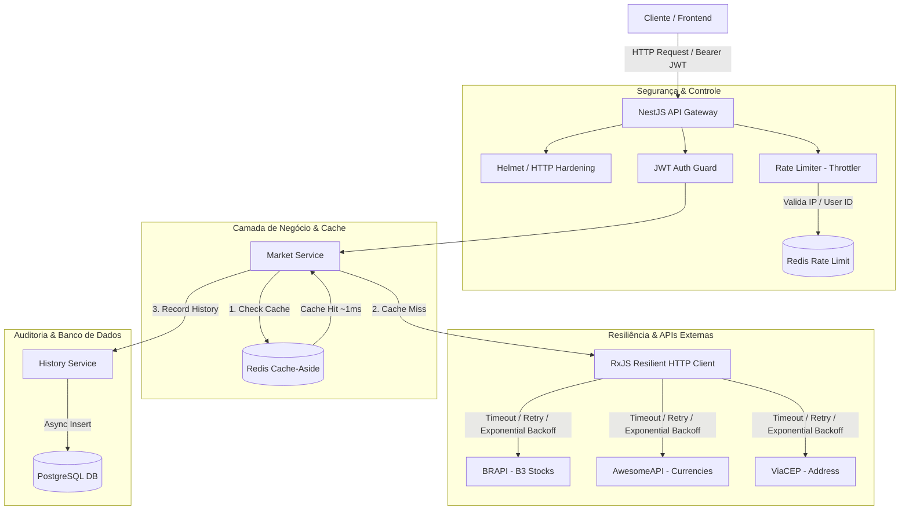

# 🚀 External Data Aggregator API


API agregadora e resiliente de dados externos desenvolvida em Node.js com NestJS e TypeScript. O sistema integra serviços de mercado financeiro (Ações B3 e Cotações de Moedas) e localização (ViaCEP), aplicando padrões avançados de arquitetura de software como **Cache-Aside com Redis**, **Rate Limiting distribuído**, **criptografia assimétrica/hashing**, **auditoria assíncrona** e **resiliência HTTP**.

---

## 🏛️ Arquitetura do Sistema

O diagrama abaixo ilustra o fluxo de requisição, verificação de cache, persistência de histórico e resiliência nas integrações externas:



---

## ✨ Destaques de Engenharia & Funcionalidades

- **Autenticação & Segurança Robustas**: Autenticação via JWT (Access & Refresh Tokens) com hashes de senha via Bcrypt. Cabeçalhos HTTP sanitizados com Helmet (OWASP) e CORS restritivo.
- **Cache-Aside de Alta Performance (Redis)**: Redução no tempo de resposta em chamadas recorrentes de ~400ms para ~1ms (99% de ganho de velocidade).
- **Rate Limiting Distribuído**: Proteção contra abusos e ataques DoS usando `@nestjs/throttler` respaldado pelo Redis, aplicando limites baseados em IP e no ID do usuário autenticado.
- **Resiliência Avançada (RxJS)**: Estratégia de chamadas externas protegidas contra timeouts, falhas intermitentes com retries e exponential backoff.
- **Auditoria de Consultas & Paginação**: Registro assíncrono de tempos de execução (`executionTimeMs`) e parâmetros consultados no PostgreSQL, expostos em endpoint paginado (`data` + `meta`).
- **Observabilidade & Terminus Health Checks**: Endpoint `/health` para monitoramento do estado das conexões com banco de dados e APIs terceiras.
- **Documentação Viva (OpenAPI/Swagger)**: Documentação interativa em `/api/docs` integrada com esquemas de DTOs e suporte a autorização Bearer.

---

## 🛠️ Tecnologias Utilizadas

- **Framework**: NestJS 11
- **Linguagem**: TypeScript
- **Banco de Dados Relacional**: PostgreSQL 16
- **ORM**: TypeORM
- **Cache Distribuído & Rate Limit**: Redis 7 / ioredis
- **Containerização**: Docker & Docker Compose (Multi-stage Build)
- **Documentação**: Swagger OpenAPI 3.0
- **Testes**: Jest & Supertest (Unitários e E2E)
- **Segurança & Validação**: Helmet, class-validator, class-transformer, Bcrypt

---

## 🚀 Como Executar o Projeto

### Pré-requisitos

- Git
- Docker & Docker Compose
- Node.js v20+ (Opcional, caso queira rodar fora do container)

### 1. Clonar o Repositório

```bash
git clone https://github.com/matheusdevoliveira/external-data-aggregator-api.git
cd external-data-aggregator-api
```

### 2. Configurar Variáveis de Ambiente

Crie o arquivo `.env` na raiz do projeto baseado no `.env.example`:

```bash
cp .env.example .env
```

### 3. Subir a Infraestrutura via Docker Compose

O comando abaixo inicia o PostgreSQL, o Redis e realiza a compilação do container da aplicação:

```bash
docker compose up -d
```

A API estará disponível em: **http://localhost:3000**

---

## 📚 Documentação da API (Swagger)

Acesse a interface interativa do Swagger OpenAPI para visualizar os esquemas e testar todas as rotas diretamente no seu navegador:

🔗 **http://localhost:3000/api/docs**

---

## 🛠️ Tabela de Endpoints

| Módulo   | Método | Rota                             | Autenticação   | Descrição                                                   |
|----------|--------|-----------------------------------|----------------|--------------------------------------------------------------|
| Health   | GET    | `/health`                         | Não            | Verifica a saúde da API e conexões com DB e terceiros        |
| Users    | POST   | `/users`                          | Não            | Cadastra um novo usuário no sistema                          |
| Auth     | POST   | `/auth/login`                     | Não            | Autentica usuário e retorna Access & Refresh Tokens           |
| Auth     | POST   | `/auth/refresh`                   | Não            | Renova o Access Token via Refresh Token                       |
| Auth     | GET    | `/auth/me`                        | Sim (Bearer)   | Retorna o perfil do usuário logado                            |
| Market   | GET    | `/market/stocks/:ticker`          | Sim (Bearer)   | Consulta cotação de ações da B3 (ex: PETR4)                    |
| Market   | GET    | `/market/currencies/:pair`        | Sim (Bearer)   | Consulta par de moedas (ex: USD-BRL)                           |
| Market   | GET    | `/market/locations/cep/:cep`      | Sim (Bearer)   | Consulta endereço por CEP no ViaCEP                            |
| History  | GET    | `/history`                        | Sim (Bearer)   | Lista o histórico de pesquisas do usuário de forma paginada    |

---

## 🧪 Executando os Testes

O projeto conta com testes unitários focados na camada de serviço e testes End-to-End (E2E) para as rotas HTTP.

```bash
# Executar testes unitários
npm run test

# Executar testes unitários com relatório de Cobertura (Coverage)
npm run test:cov

# Executar testes End-to-End (E2E)
npm run test:e2e
```
